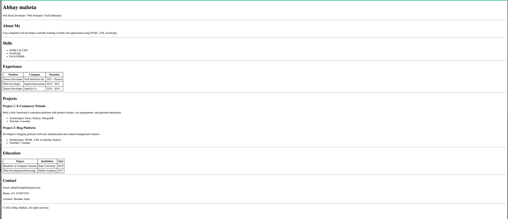

This is a single-page resume website built using only HTML.
No CSS or JavaScript is used.

## Features
- Header with name
- About section
- Skills list
- Experience table
- Projects section
- Education table
- Contact details

## Technologies Used
- HTML5 only

## How to Run
1. Download or clone the repository
2. Open index.html in any web browser

## Screenshots

